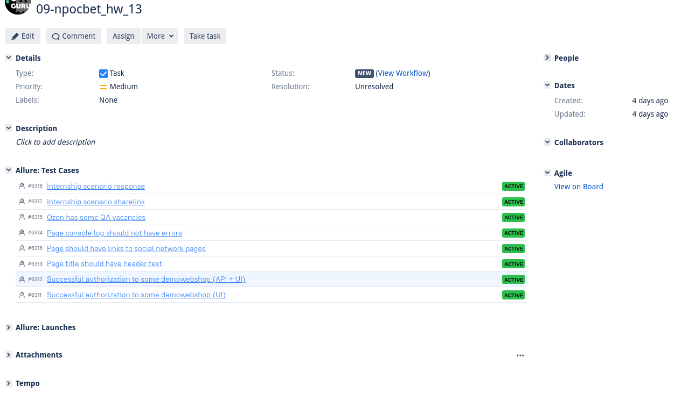

# The test automation project for JOB.OZON.RU
<a target="_blank" href="https://job.ozon.ru/">OZON job</a>

## The project is done with the following technologies:
<a href="https://www.java.com/en/">
    
</a>
<a href="https://gradle.org/">
    
</a>
<a href="https://junit.org/junit5/">
    
</a>
<a href="https://www.jetbrains.com/idea/">
    
</a>
<a href="https://ru.selenide.org/">
    
</a>
<a href="https://docs.qameta.io/allure/">
    
</a>
<a href="https://github.com/npocbet/qaguru_13">
    
</a>

## Jenkins job
<a target="_blank" href="https://jenkins.autotests.cloud/job/09-npocbet_hw_13/">jenkins.autotests.cloud/job/</a>

## Infrastructure:
<a href="https://jenkins.autotests.cloud/job/09-npocbet_hw_13/">
    
</a>
<a href="https://selenoid.autotests.cloud/#/">
    
</a>

## Test & Release management:

<a href="https://allure.autotests.cloud/project/811/test-cases?treeId=0">
    
</a>

<a href="https://jira.autotests.cloud/browse/HOMEWORK-289">
    
</a>

## USAGE examples

### For run remote tests need fill remote.properties or to pass value:

* browser (default chrome)
* browserVersion (default 91.0)
* browserSize (default 1920x1080)
* browserMobileView (mobile device name, for example iPhone X)
* remoteDriverUrl (url address from selenoid or grid)
* videoStorage (url address where you should get video)
* threads (number of threads)


Run tests with filled remote.properties:
```bash
gradle clean test
```

Run tests with not filled remote.properties:
```bash
gradle clean -DremoteDriverUrl=https://%s:%s@selenoid.autotests.cloud/wd/hub/ -DvideoStorage=https://selenoid.autotests.cloud/video/ -Dthreads=1 test
```

Serve report:
```bash
allure serve build/allure-results
```


###### For further development there are some example tests in src/test/java/cloud.autotests/tests/demowebshop
* remove @Disabled("...") annotation to run tests
```bash
gradle clean demowebshop
```

:heart: <a target="_blank" href="https://qa.guru">qa.guru</a><br/>
:blue_heart: <a target="_blank" href="https://t.me/qa_automation">t.me/qa_automation</a>

## Results analysis

The test results can be found in:
+ [Jenkins](#jenkins)
+ [Allure Report](#allure-report)
+ [Allure TestOps](#allure-testOps)
+ [Jira](#jira)


### [Jenkins](https://jenkins.autotests.cloud/job/09-npocbet_hw_13/)

For the running autotests in Jenkins, you can specify the parameters described
in :point_up:  [Run tests without filled remote properties](#run-tests-without-filled-remote-properties).

After selecting the necessary parameters, you need to click the Submit (Собрать) button.

<p align="center">
  
</p>

Once the launch is finished you may watch statistics and open the `Allure Report` 

<p align="center">
  
</p>

### Allure Report

Here are the examples of a report about test build with grouping by tags (:
point_up: [The list of tests grouped by tag parameter](#the-list-of-tests-grouped-by-tag-parameter))

:
arrow_right: [The launch with results for tag = main_page](https://jenkins.autotests.cloud/job/09-elenakomarova-itfinland-project-ui/32/allure/)

<p align="center">
  
</p>

### Allure TestOps

Allure TestOps is used as a storage for all tests cases (automated and manual), launches, their results. You may watch statistic and reports by all launches and results

:arrow_right: Dashboard:

<p align="center">
  
</p>

:arrow_right: List of launches:

<p align="center">
  
</p>

:arrow_right: List of tests grouped by features and their history of launches:

<p align="center">
  
</p>

### Jira

Also Jira integration is implemented in the project:

<p align="center">
  
</p>


___

## Example of video with test running in Allure Report

You may see the example of a video showing the test run in Allure report.

<p align="center">
  
</p>


___

## Notifications in Telegram channel

The project is configured to send notifications about the results of launches from Jenkins to Telegram channel

<p align="center">
  
</p>

<p align="center">
  
</p>
